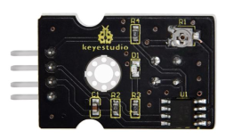
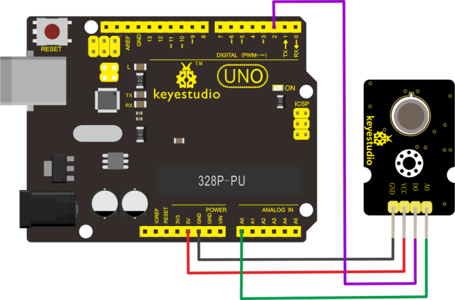
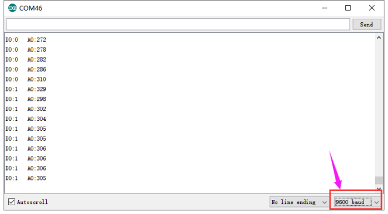

# KS0451 Keyestudio MS1100 Formaldehyde Benzene VOC Gas Sensor


## 1. Overview

The keyestudio formaldehyde-toluene-methane-ethanol-tobacco gas sensor is particularly for detecting specific gas contents. It can detect the gas more than 0.1ppm.

It is suitable for detecting various organic volatile components such as formaldehyde, benzene, methane, xylene and ethanol in the air.

The sensor has two pins A0 and D0. The A0 pin represents the detection of other content. The larger the content, the larger the A0 analog value is.

The D0 pin represents whether the gas content exceeds the zero threshold. When it exceeds, D0 outputs a HIGH level; not exceed, D0 outputs LOW. We can adjust the zero threshold value by the potentiometer on the back.

The sensor has an LED to indicate whether the gas content exceeds the set zero limit. The sensor comes with a positioning hole with a diameter of 3.2mm, easy for mounting on other devices. This sensor can be used with other microcontrollers, such as the Arduino microcontroller.



## 2. Specifications

- Operating voltage: DC 5V
- Operating current: 100mA
- Maximum power: 1W
- Operating temperature range: -25°C to 65°C
- Interface type: 4pin header with 2.54mm pitch
- Positioning hole diameter: 3.2mm
- Dimensions: 33mm * 18mm * 9mm
- Weight: 3.4g
- Environmental attributes: ROHS

## 3. Wring Diagram



## 4. Test Code

Download code：[Code](./Code.7z)

```c
#define Aout A0
#define Dout 2

void setup() 
{
    // put your setup code here, to run once:
	Serial.begin(9600);
	pinMode(Aout,INPUT);
  	pinMode(Dout,INPUT);
}

void loop() 
{
    // put your main code here, to run repeatedly:
    int a=analogRead(Aout);
    int b=digitalRead(Dout);
    Serial.print("D0:");
    Serial.print(b);
    Serial.print("   A0:");
    Serial.println(a);
    delay(300);
}
```

## 5. Test Result

Done uploading the code, open the Arduino IDE and set the baud rate to 9600. The greater the measured gas concentration, the greater the A0 value is.

When the detected gas exceeds the set zero limit, D0 is 1, the D1 LED on the sensor lights up; otherwise D0 is 0, and the D1 LED on the sensor is off.

